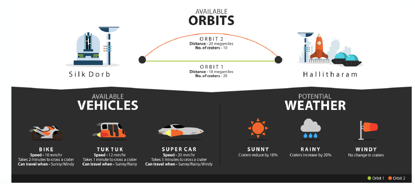

##### Programming Language: JAVA
##### IDE: Intellij
##### Java Version: 21
##### Conditions:
- Use Object-Oriented Programming (OOP).
- Write production ready code.
- Writing tests for your solution is advantages.

# Traffic

### Goal:
To go from Silk Dorb to Hallitharam in the shortest time
possible.

###### Orbit options:
* Orbit 1 - 18 mega miles & 20 craters to cross
* Orbit 2 - 20 mega miles & 10 craters to cross
###### Vehicle options:
* Bike - 10 mega miles/hour & takes 2 min to cross 1 crater
* Tuktuk - 12 mm/hour & takes 1 min to cross 1 crater
* Car - 20 mm/hour & takes 3 min to cross 1 crater
###### Weather conditions (affects the number of craters in an orbit):
* Sunny - craters reduce by 10%. Car, bike and tuktuk can be used in this weather.
* Rainy - craters increase by 20%. Car and tuktuk can be used in this weather.
* Windy - no change to number of craters. All vehicles can be used in this weather.

### Analysis:
King Shan wants to visit the suburb of Hallitharam,
- The king has 2 possible orbits/routes. Each of the routes has a defined distance and craters to go through.
- The king has three possible vehicle choices. 
* The challenge is to determine which orbit/route and vehicle combination will yield the fastest journey time.
* Each orbit/route has its own properties
- The king can choose any vehicle. 
- Each vehicle has its own properties. E.g. Speed, time to cross a crater, suitable weathers.
* Weather conditions affect the number of craters on a route/ in an orbits. 
* It can change (reduce/increase) craters by percentages. So weather has an impact on orbits/routes as well.

##### Solution steps:
	1.	Get weather by weather-type.
	2. 	Based on weather type get all suitable vehicle names and get their corresponding Vehicle objects.
	3. 	Get all available orbit-sequences to traverse single/multiple destinations and update them with user inputs (i.e. speed limit)
	4.	Now, based on weather type we can identify actual number of craters for each available orbit.
	5.	Find out optimum traverse time for each orbit/route - sequence and vehicle combination.
	6.	Compare these times and find out the optimized one.

##### Objects:

*  Orbit[source: String; destination: String; number of craters: Integer; distance (mega mile): Integer; speed limit: Velocity]
*  Weather Condition[weather type: enum; list of possible vehicle names: List<String>; change rate (+/- XX%): Integer;]
*  Vehicle[name: String; speed: Velocity; time to cross a cracker(minutes): Integer]
*  Velocity[speed: Integer; unit: String (mega miles/hour)]
*  TraverseDetail[time (minutes): Integer; sequence of orbits: List<Orbit>, vehicle: Vehicle]

> Rules:

* For any orbit source and destination, can't be interchanged. As road could be two ways.
* Unit of speed limit of an orbit and vehicle's speed should be same. Default unit is mega miles/hour.
* A vehicle cannot travel faster than the traffic speed for an
  orbit. So even though a car’s max speed is 20 mega miles/hour, it
  can only go at 10 mega miles/hour if that is the traffic speed for
  that orbit. Also, if there is a tie in which vehicle to choose, use
  bike, auto,car in that order.

> N.B:

*	In this application, **TrafficInitializer** is responsible for providing the specified weathers conditions, orbits and vehicles. In the real time application, these values will be stored and retrieved from a database or file system or via a third party web service.
 
